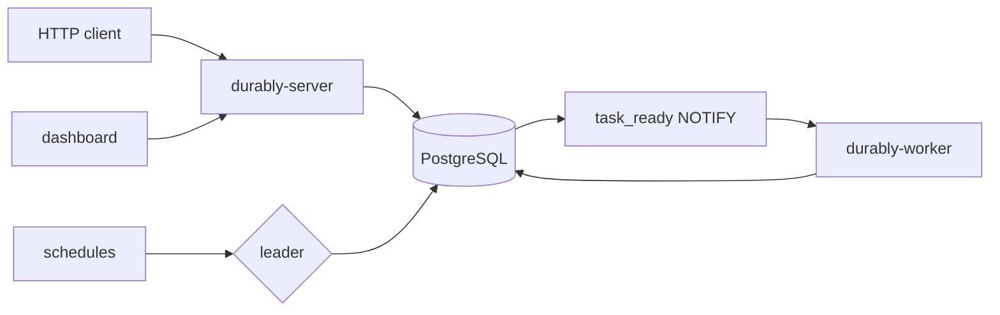

# durably

A durable workflow and job engine. You write a workflow as an ordinary async function, and the engine takes care of the rest: a worker can be killed mid-step, the database can be cut in half, and the run still finishes. State lives in PostgreSQL and nowhere else, so there is no broker, no Redis, and no second system to keep consistent. Execution is at-least-once, and the idempotency key handed to every step is what makes the effects exactly-once.

- Steps recorded once, never re-executed
- Leases with a reaper, so a dead worker's task is picked up by a survivor
- Single-writer state transitions guarded by compare-and-set on task id and lease token
- Retries with exponential backoff and full jitter, then a dead letter
- Durable sleeps and cron schedules with timezone and DST handling
- Multi-tenancy with per-tenant concurrency limits and round-robin claiming
- Leader election over a PostgreSQL advisory lock, with no separate scheduler process
- Prometheus metrics, structured logs, and OpenTelemetry traces
- An HTTP API and an operator dashboard

## Architecture



`runs`, `steps`, and `tasks` are the only tables the engine needs. A worker claims a task with `FOR UPDATE SKIP LOCKED`, replays the workflow function from the top, and every step whose result is already recorded returns immediately without calling the step function. Exactly one worker at a time holds the advisory lock, and that worker runs the lease reaper, the stuck-run repair, and the cron ticker.

See [docs/design.md](docs/design.md) for the full design and [docs/benchmarks.md](docs/benchmarks.md) for measured numbers.

## Quickstart

Requires Node 20+, pnpm, and Docker.

```bash
git clone https://github.com/Prabodh-dev/durably.git
cd durably
pnpm install
docker compose up -d
```

That starts PostgreSQL on `localhost:15432`, the API on `localhost:3000`, and a worker. Prometheus is on `localhost:9095` and Grafana on `localhost:3001`.

Start a run:

```bash
curl -X POST http://localhost:3000/v1/runs \
  -H 'content-type: application/json' \
  -d '{"workflow":"onboard-user","input":{"email":"ada@example.com","name":"Ada","plan":"pro"}}'
```

Poll it:

```bash
curl http://localhost:3000/v1/runs/<run id>
```

`GET /healthz` and `GET /metrics` are exposed by the API; the worker serves `/metrics` when `DURABLY_WORKER_METRICS_PORT` is set. Configuration is listed in `.env.example`.

## Writing a workflow

A workflow is a function. Steps are the unit of retry and the unit of durability, so side effects belong inside them, keyed by the idempotency key the engine provides.

```ts
import { createWorker, defineWorkflow } from '@durably/sdk';

const refundOrder = defineWorkflow<
  { orderId: string; amount: number },
  { refunded: boolean }
>(
  {
    id: 'refund-order',
    retry: { maxAttempts: 6, baseDelayMs: 250, maxDelayMs: 2000 }
  },
  async ({ input, step }) => {
    const payment = await step.run('refund-payment', async (idempotencyKey) => {
      const response = await payments.refund({
        orderId: input.orderId,
        amount: input.amount,
        idempotencyKey
      });
      return { reference: response.reference };
    });

    await step.sleep('wait-for-clearing', '24h');

    await step.run('notify-customer', async () => {
      await mailer.send({
        orderId: input.orderId,
        reference: payment.reference
      });
    });

    return { refunded: true };
  }
);

const worker = createWorker({
  databaseUrl: process.env.DATABASE_URL,
  workflows: [refundOrder]
});

await worker.start();
```

`step.sleep` and `step.sleepUntil` release the worker slot while the run waits, so a day-long wait costs one row and no thread.

Trigger a run from anywhere:

```ts
import { createClient } from '@durably/sdk';

const client = createClient({ baseUrl: 'http://localhost:3000' });
const run = await client.run({
  workflow: 'refund-order',
  input: { orderId: 'order_123', amount: 4900 }
});
```

## Tests

```bash
pnpm test
```

Tests run against a real PostgreSQL started with Testcontainers, and crash behavior is tested with real worker processes and real `SIGKILL`s. Nothing in the database layer is mocked. The suite needs Docker and takes a few minutes.

## Demos and benchmarks

```bash
node scripts/demo-crash.mjs   # kills a worker mid-run, shows the run completing anyway
node scripts/bench.mjs        # end-to-end throughput, prints JSON
node scripts/queue-model.mjs  # claim path under contention, prints JSON
```

`demo-crash.mjs` brings up the compose stack with three workers, starts a run, kills the worker holding it, and prints the run's outcome.

## Contributing

Read `AGENTS.md` before changing anything. It documents the correctness invariants, the database resilience rules, and the testing requirements.

## License

MIT, see [LICENSE](LICENSE).
